# 💎 Wallet System — Full Stack Application

A complete **Digital Wallet Platform** built using **.NET 9 (Clean Architecture)**, **Angular 20**, and **PostgreSQL 20**.  
It demonstrates a modern full-stack architecture featuring **secure authentication**, **wallet management**, **transaction tracking**, and **admin dashboards**.

---

## 🧭 Overview

The **Wallet System** allows users to:

- 🔐 Register & log in securely (JWT-based)
- 💰 Manage wallets and balances in multiple currencies
- 💸 Perform and track transactions (Top-up, Payment, Refund)
- 🧑‍💼 Allow admins to monitor users, wallets, and transactions

The solution follows **Clean Architecture** with **CQRS + MediatR**, ensuring scalability, separation of concerns, and testability.

---

## ⚙️ Tech Stack

| Layer              | Technology                                  |
| ------------------ | ------------------------------------------- |
| **Frontend**       | Angular 20, SCSS, TypeScript                |
| **Backend**        | .NET 9, Clean Architecture, MediatR, EFCore |
| **Database**       | PostgreSQL 17                               |
| **Authentication** | JWT (JSON Web Tokens)                       |
| **ORM**            | Entity Framework Core                       |
| **Design Pattern** | CQRS, Repository Pattern                    |
| **API Docs**       | Swagger / OpenAPI                           |

---

## 🧩 Project Structure

```
wallet-system/
│
├── backend/                 # .NET 9 Clean Architecture API
│   ├── Wallet.Api
│   ├── Wallet.Application
│   ├── Wallet.Domain
│   └── Wallet.Infrastructure
│
├── frontend/                # Angular 20 Application
│   └── src/
│
├── database/                # PostgreSQL Backup & Schema
│   └── WalletDb.backup
│
└── README.md                # Root-level documentation (this file)
```

---

## 🚀 How to Run

### 🧱 1️⃣ Setup Database

Restore the database using **pgAdmin** or CLI:

```bash
pg_restore -U postgres -d WalletDb "database/WalletDb.backup"
```

### ⚙️ 2️⃣ Run Backend (.NET 9 API)

```bash
cd backend/Wallet.Api
dotnet restore
dotnet run
```

API will be running at 👉 **https://localhost:7124**

### 🌐 3️⃣ Run Frontend (Angular 20)

```bash
cd frontend
npm install
ng serve
```

App available at 👉 **http://localhost:4200**

---

## 📊 Core Features

### 👤 User
- Register / Login / Logout  
- View wallet balance  
- Perform Top-up / Payment transactions  
- View transaction history  

### 🧑‍💼 Admin
- View all users, wallets, and transactions  
- Manage users & transactions  
- Dashboard analytics (total users, balances, etc.)

---

## 🧠 Technical Highlights

- ✅ Clean separation of layers  
- ✅ MediatR for CQRS (Command–Query pattern)  
- ✅ EF Core with Repository abstraction  
- ✅ FluentValidation for input validation  
- ✅ Secure JWT-based authentication  

---

## 🧱 Database Schema Overview

```
Users (1) ────< (∞) Wallets (1) ────< (∞) Transactions
```

- Each user can have multiple wallets  
- Each wallet contains multiple transactions  
- Cascade deletion ensures referential integrity  

---

## 🖼️ Screenshots

### 🔐 Authentication
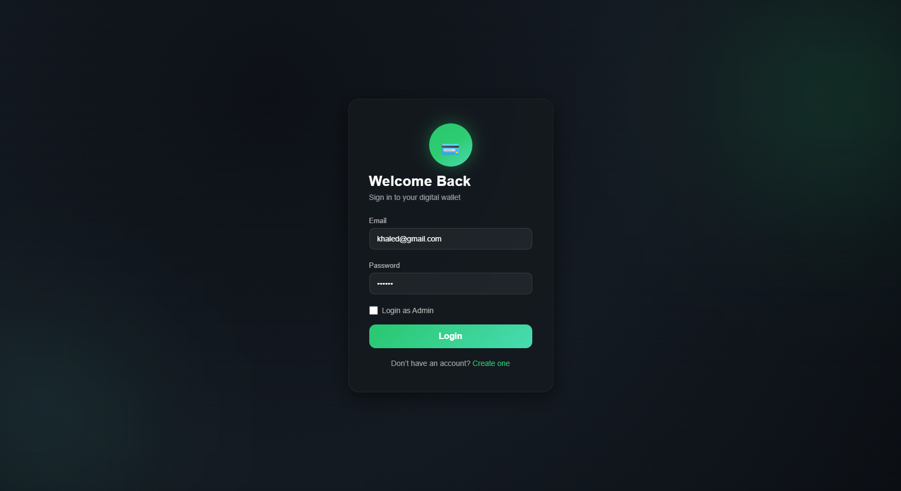
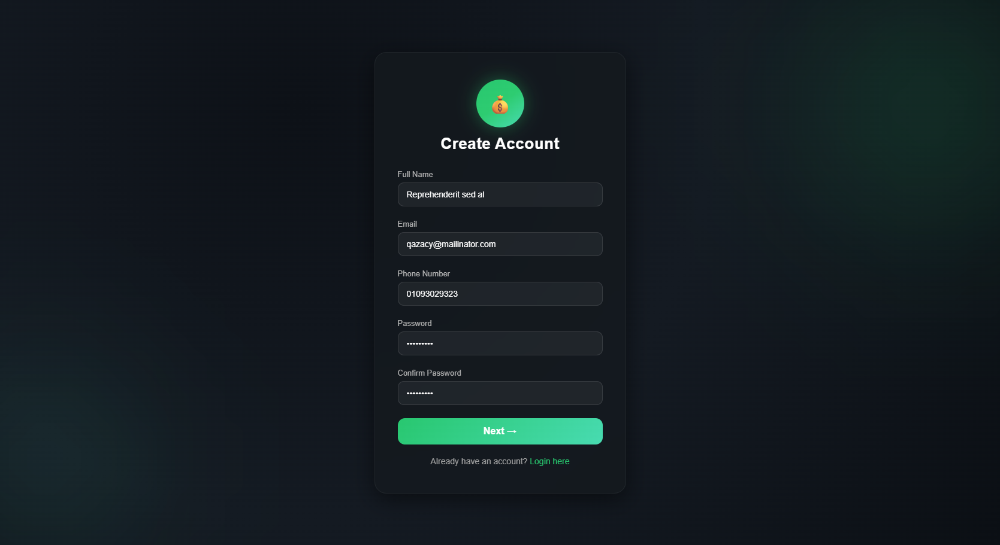
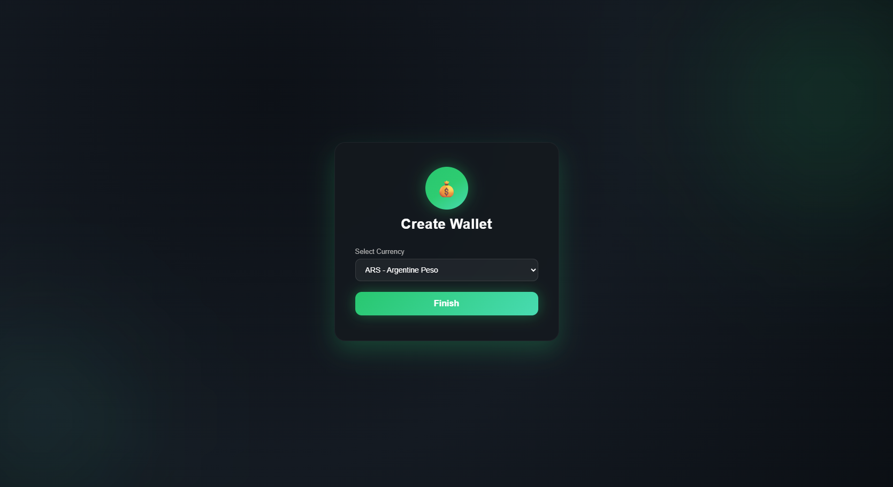
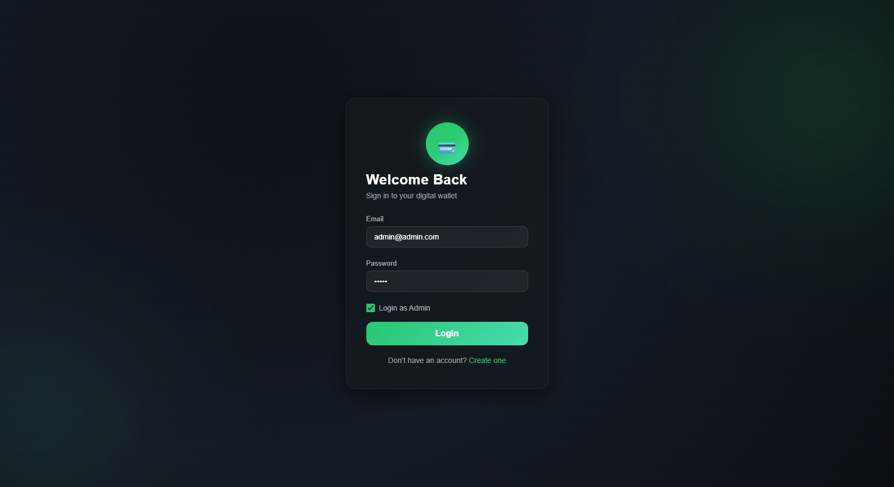

### 💼 Admin Dashboard
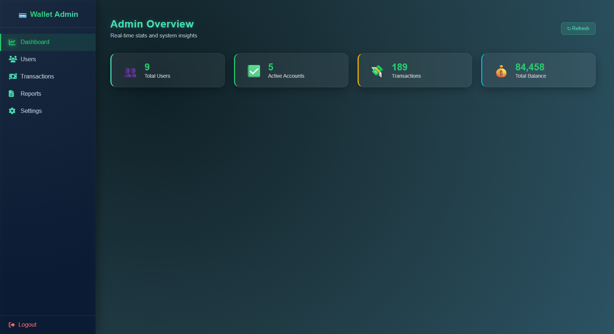

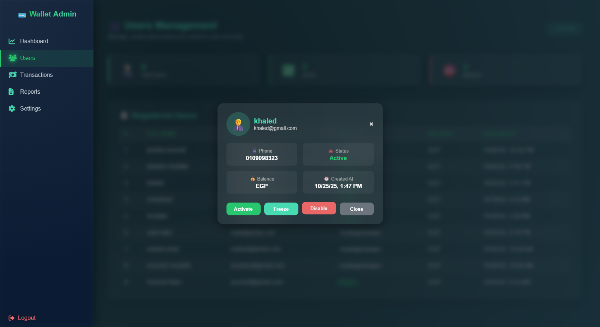
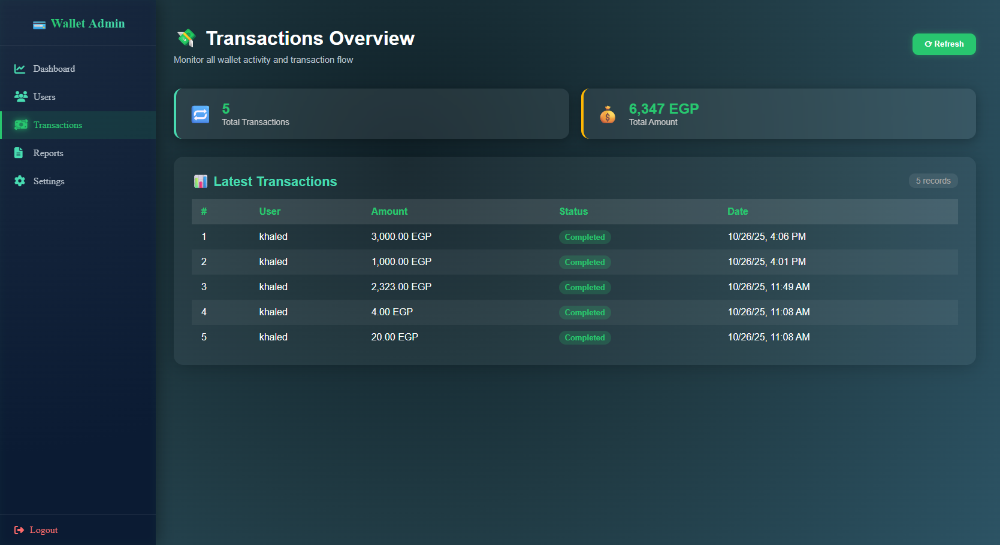

### 👤 User Portal
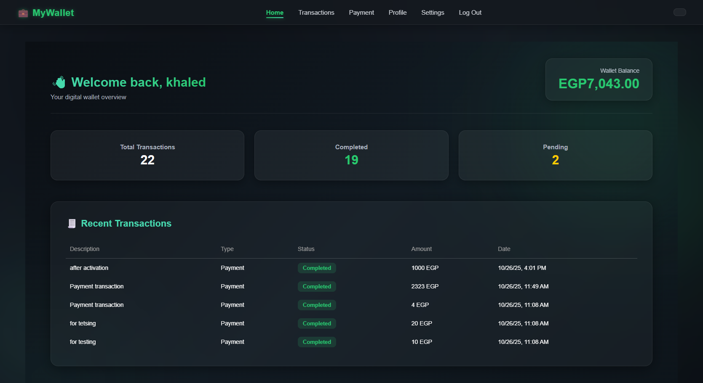
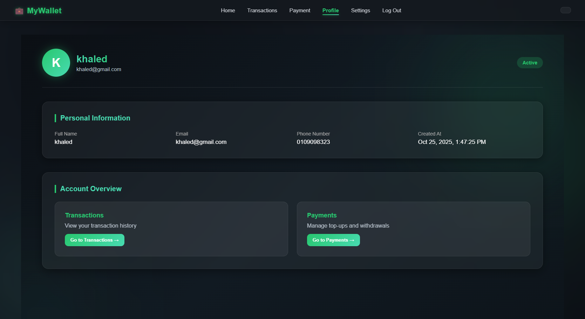
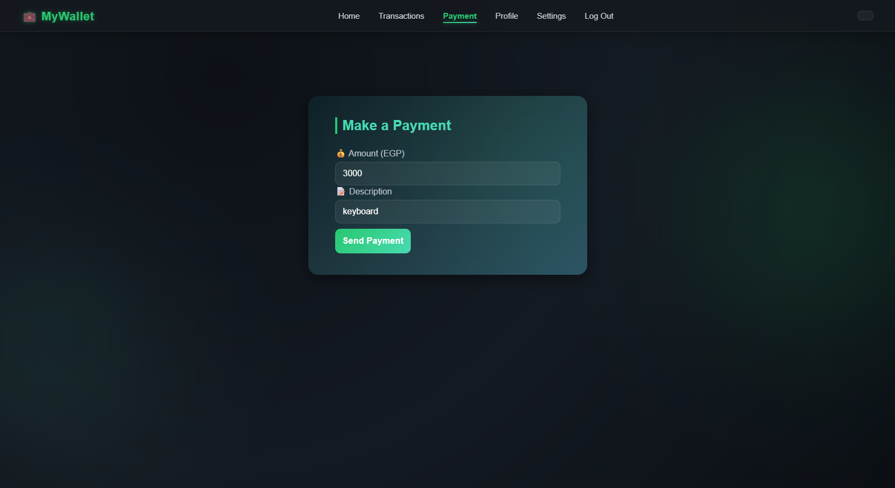
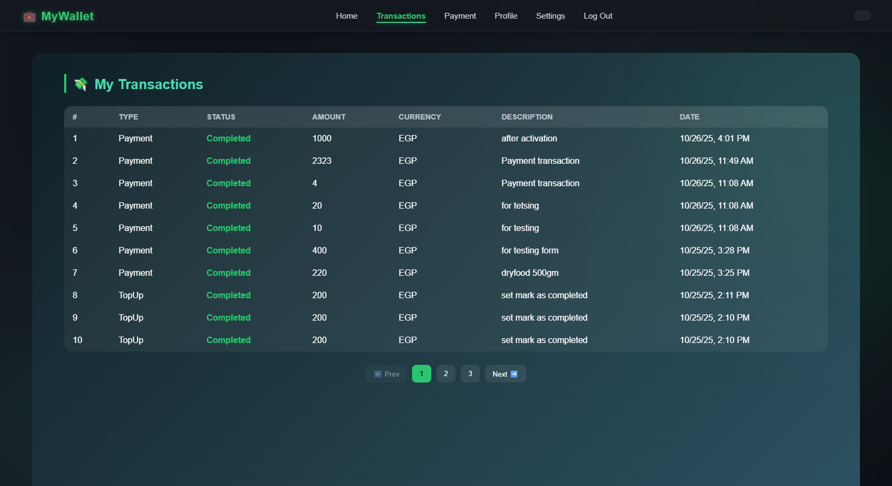
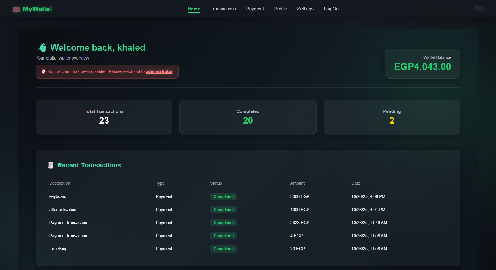
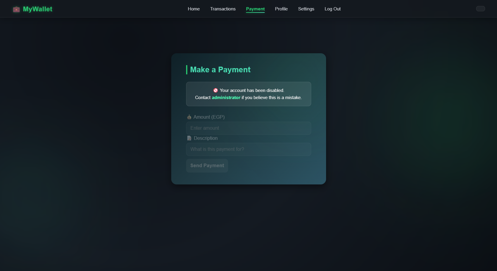

---

## 👨‍💻 Author

**Mohamed Aftah**  
Full Stack Developer — (.NET | Angular | PostgreSQL)  

📧 [mohamedaftah04@gmail.com](mailto:mohamedaftah04@gmail.com)  
🔗 [GitHub](https://github.com/MohamedAftah004)  
🔗 [LinkedIn](https://www.linkedin.com/in/mabd-elfattah/)
