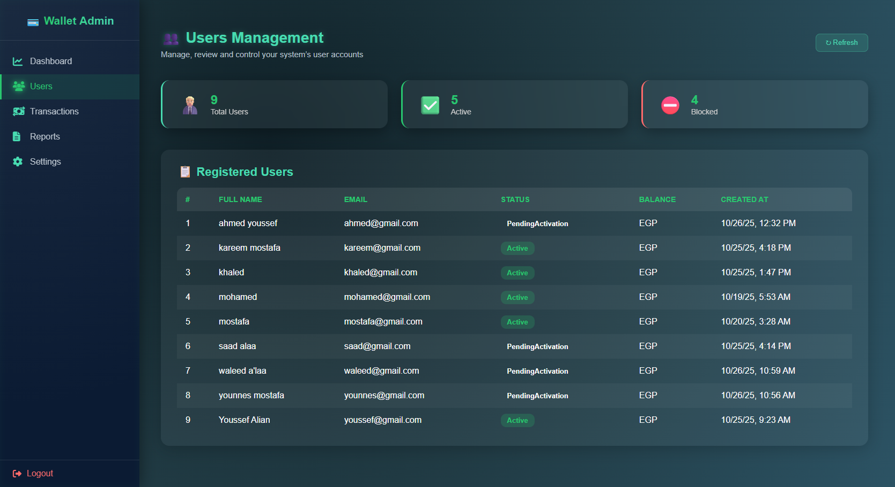

# 💎 Wallet System — Full Stack Application

A complete **digital wallet platform** built using **.NET 9 (Clean Architecture)**, **Angular 20**, and **PostgreSQL 20**.  
This project demonstrates modern full-stack architecture, featuring secure authentication, wallet management, transactions tracking, and admin dashboards.

---

## 🧭 Overview

The **Wallet System** enables users to:

- 🔐 Register & log in securely (JWT-based)
- 💰 Manage wallets and balances in multiple currencies
- 💸 Perform and track transactions (Top-up, Payment, Refund)
- 🧑‍💼 Admins can monitor users, wallets, and overall system activity

This solution follows **Clean Architecture** principles with **CQRS + MediatR**, ensuring scalability, separation of concerns, and testability.

---

## ⚙️ Tech Stack

| Layer              | Technology                                  |
| ------------------ | ------------------------------------------- |
| **Frontend**       | Angular 20, SCSS, TypeScript                |
| **Backend**        | .NET 9, Clean Architecture, MediatR, EFCore |
| **Database**       | PostgreSQL 17                               |
| **Auth**           | JWT (JSON Web Tokens)                       |
| **ORM**            | Entity Framework Core                       |
| **Design Pattern** | CQRS, Repository Pattern                    |
| **API Docs**       | Swagger / OpenAPI                           |

---

## 🧩 Project Structure

wallet-system/
│
├── backend/ # .NET 9 Clean Architecture API
│ ├── Wallet.Api
│ ├── Wallet.Application
│ ├── Wallet.Domain
│ └── Wallet.Infrastructure
│
├── frontend/ # Angular 20 Application
│ └── src/
│
├── database/ # PostgreSQL Backup & Schema
│ └── WalletDb.backup
│
└── README.md # Root-level documentation (this file)

yaml
Copy code

---

## 🚀 How to Run

### 🧱 1️⃣ Database

Restore the database using pgAdmin or CLI:

```bash
pg_restore -U postgres -d WalletDb "database/WalletDb.backup"
⚙️ 2️⃣ Backend API (.NET 9)
bash
Copy code
cd backend/Wallet.Api
dotnet restore
dotnet run
Runs the API at https://localhost:7124

🌐 3️⃣ Frontend (Angular 20)
bash
Copy code
cd frontend
npm install
ng serve
App available at: http://localhost:4200

📊 Core Features
👤 User Features
Register / Login / Logout

View wallet balance

Perform top-up or payment transactions

View recent transaction history

🧑‍💼 Admin Features
View all users, wallets, and transactions

Filter, sort, and manage transactions

Dashboard analytics (total users, balances, etc.)

🧠 Technical Highlights
Clean separation of layers

MediatR for command-query handling

EF Core with repository abstraction

FluentValidation for request validation

Secure JWT authentication

🧱 Database Schema Overview
scss
Copy code
Users (1) ────< (∞) Wallets (1) ────< (∞) Transactions
Each User can have multiple Wallets

Each Wallet contains multiple Transactions

Cascade deletion ensures data consistency

📸 UI Preview
Dark modern dashboard interface built in Angular 20
with admin & user views, responsive design, and styled SCSS components.


## 🖼️ Screenshots

### 🔐 Authentication


### 💼 Admin Dashboard




### 👤 User Portal


👨‍💻 Author
Mohamed Aftah
Full Stack Developer — (.NET | Angular | PostgreSQL)
📧 mohamedaftah04@gmail.com
🔗 [GitHub](https://github.com/MohamedAftah004)
🔗 [LinkedIn](https://www.linkedin.com/in/mabd-elfattah/)

```
